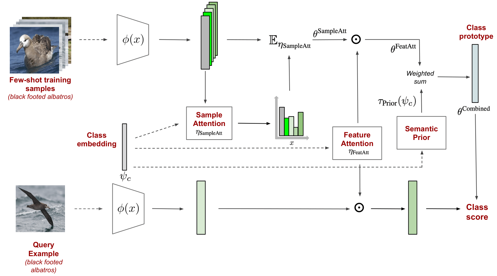

# Semantics-driven attentive few-shot learning over clean and noisy samples

The code repository for "Semantics-driven attentive few-shot learning over clean and noisy samples" [[paper]](https://doi.org/10.1016/j.neucom.2022.09.121) [[ArXiv]](...) (Accepted by NEUCOM 2022) in PyTorch. If you use any content of this repo for your work, please cite our work using the following:

    @article{BARAN202259,
        title = {Semantics-driven attentive few-shot learning over clean and noisy samples},
        journal = {Neurocomputing},
        volume = {513},
        pages = {59-69},
        year = {2022},
        issn = {0925-2312},
        doi = {https://doi.org/10.1016/j.neucom.2022.09.121},
        url = {https://www.sciencedirect.com/science/article/pii/S0925231222012140},
        author = {Orhun Bugra Baran and Ramazan Gokberk Cinbis},
        keywords = {Few-shot learning, Vision and language integration},
        }

## Abstract

Over the last couple of years, few-shot learning (FSL) has attracted significant attention towards minimizing the dependency on labeled training examples. An inherent difficulty in FSL is handling ambiguities resulting from having too few training samples per class. To tackle this fundamental challenge in FSL, we aim to train meta-learner models that can leverage prior semantic knowledge about novel classes to guide the classifier synthesis process. In particular, we propose semantically-conditioned feature attention and sample attention mechanisms that estimate the importance of representation dimensions and training instances. We also study the problem of sample noise in FSL, towards utilizing meta-learners in more realistic and imperfect settings. Our experimental results demonstrate the effectiveness of the proposed semantic FSL model with and without sample noise.

## Requirements

The following packages are required to run the scripts:

- PyTorch-1.1 and torchvision

- Dataset: please download the dataset and put images into the folder data/[name of the dataset, miniimagenet or cub]/images

- Pre-trained weights for the feature extractors can be downloaded by using the `download_weight.sh`.

- Download the embeddings for MiniImageNet by using [MiniImagenet-embs](https://drive.google.com/file/d/1bThqlzJkeE7hx3NU2cWkbpp74wUDtnxd/view?usp=sharing) and place it under `data/miniimagenet/`.

## Running the code

For example, to train the 5-shot 5-way CombinedProtoNet model with ResNet-12 backbone on MiniImageNet:

    $ python train_fsl.py --model_class CombinedProtoNet  --backbone_class Res12 --dataset MiniImageNet --way 5 --eval_way 5 --shot 5 --eval_shot 5 --query 15 --eval_query 15

For further arguments please take a look at `model/utils.py`.

## Acknowledgment
Our code benefits from the following repos.
- [ProtoNet](https://github.com/cyvius96/prototypical-network-pytorch)

- [FEAT](https://github.com/Sha-Lab/FEAT)

- [AM3](https://github.com/ServiceNow/am3)